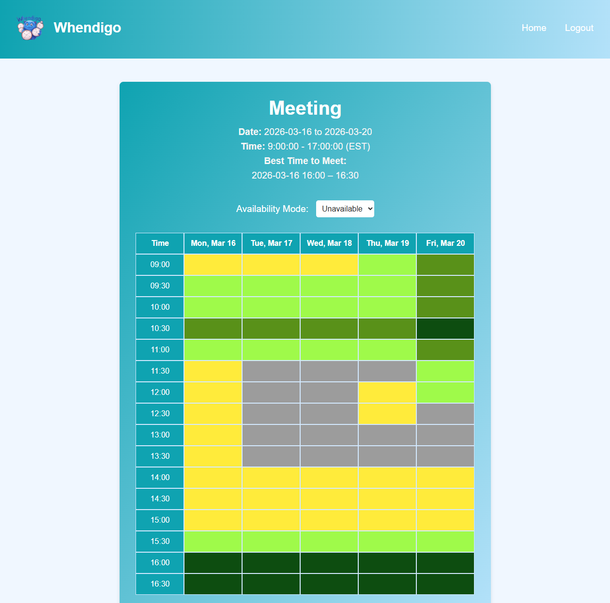

# 📅 Whendigo

A real-time, group scheduling web app inspired by <a href="https://when2meet.com">When2Meet</a>, built to make group coordination fast, easy, and intuitive.

---

<p align="center">
    
</p>

## About

**Whendigo** solves the age-old problem of finding a meeting time that works for everyone. By providing an intuitive interface for users to mark their availability, Whendigo aggregates all inputs and visualizes the optimal meeting times using a real-time heatmap.

---

## Features

- **Secure User Authentication**: Robust login and registration system with encrypted credentials using `scrypt`.
- **Event Creation & Invitation**: Users can create events, set a date and time range, and invite others via email, even if they haven't signed up yet.
- **Interactive Availability Grid**: Intuitive click-and-drag grid UI for users to seamlessly input their availability.
- **Heatmap Visualization**: Real-time, color-coded visualization of the full group's availability.
- **Best Time Calculation**: Automatically calculates and displays the optimal meeting time based on when the most participants are free.
- **Live Synchronization**: Built with Socket.IO for seamless real-time updates across all active users.

---

## Tech Stack

| Layer          | Technologies                  |
| -------------- | ----------------------------- |
| **Frontend**   | HTML, CSS, JavaScript, Jinja  |
| **Backend**    | Python, Flask, SocketIO       |
| **Database**   | MySQL                         |
| **Deployment** | Docker, Docker Compose, Azure |

---

## Local Development

Before you begin, ensure Docker and Docker Compose are installed on your system.

1. **Clone the repository:**

    ```bash
    git clone https://github.com/owenirving/whendigo.git
    cd whendigo
    ```

2. **Configure Environment Variables:**
   Create a `.env` file in the root directory and add the following configuration variables:

    ```env
    DB_SALT=your_salt_here
    SECRET_KEY=your_secret_key_here
    ENCRYPTION_KEY=your_encryption_key_here
    # Add any database credentials if additionally required
    ```

3. **Build and Run the Containers:**

    ```bash
    docker-compose up --build
    ```

4. **Access the Application:**
   Open your browser and navigate to `http://localhost:8080`.

## Future Improvements

We have exciting plans for the future of Whendigo:

- [ ] **Email Notifications & Invite Links**: Automated emails for event invitations and updates.
- [ ] **Admin Dashboard**: Analytics and management interface for event creators.
- [ ] **Time Zone Support**: Automatic conversion and synchronization across different participant time zones.
- [ ] **Enhanced Event Details**: Support for rich descriptions, meeting links, and detailed invitee lists.
